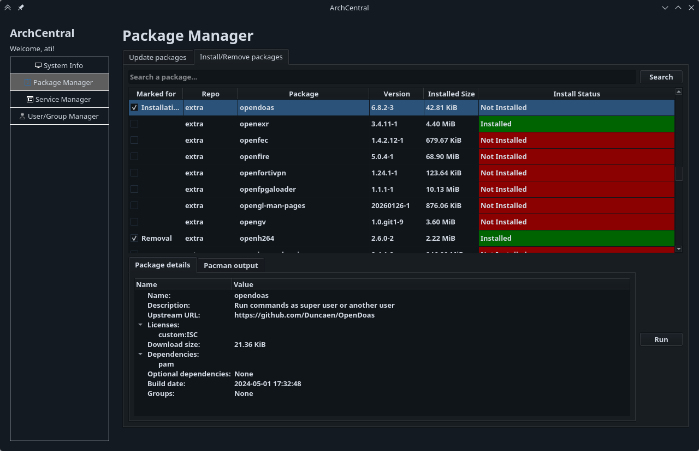
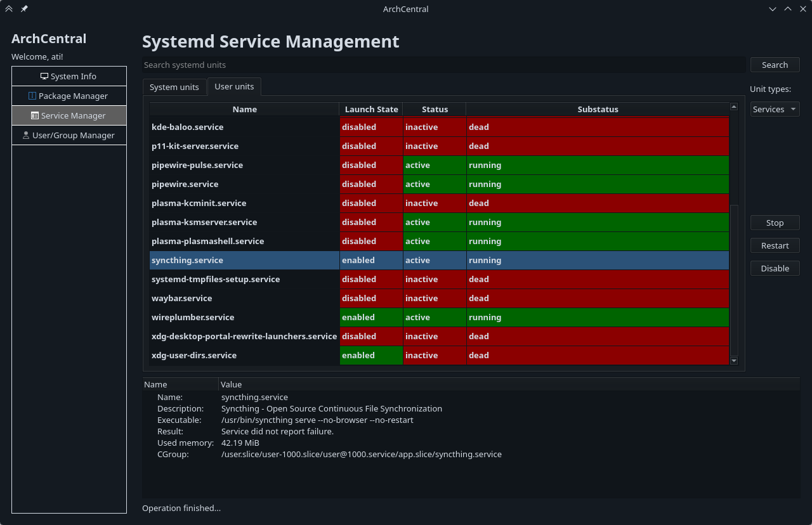
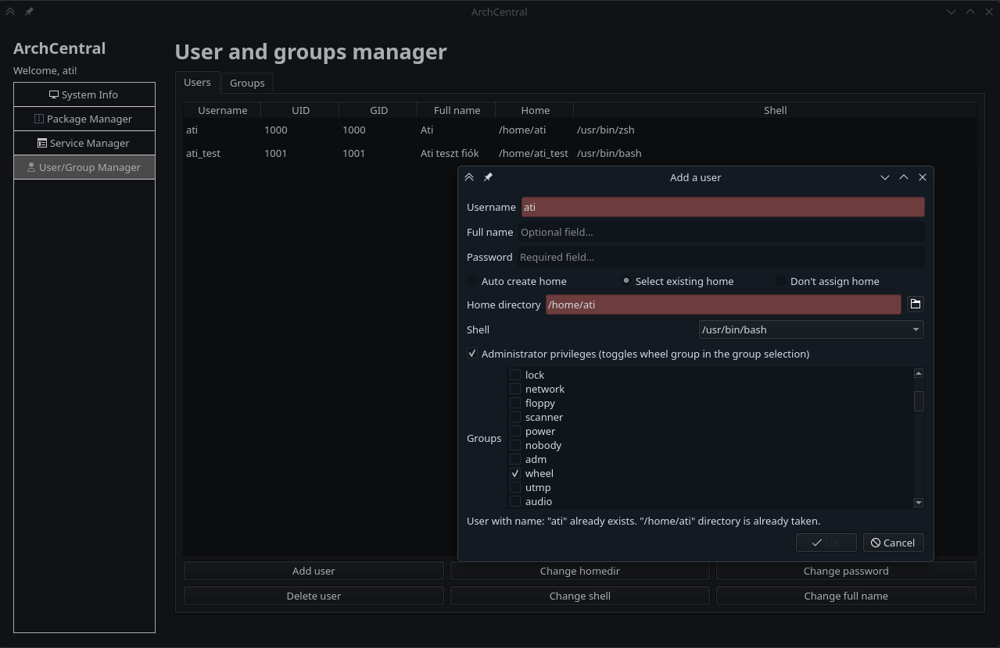

# Szakdolgozat 2025-26 - GUI vezérlőpult készítése az Arch Linux disztribúcióhoz

Ebben a repositoryban érhető el a szakdolgozatom tárgyát képező projekt.

## Mappák:
- archcentral: a python projekt helye
- archcentral-tests: a projekthez tartozó pytest teszt kollekció helye
- screenshots: képernyőképek a programról
- tools: a fejlesztést segítő szkriptek és egyebek

## A projekt közvetlen futtatásához szükséges:

0. Legyünk a projekt gyökérkönyvtárában, és legyenek a rendszeren telepítve a következő csomagok:
    - pkgconf
    - base-devel
    - python-cairo

1. Egy virtual environment (venv) létrehozása és használata:
    ```bash
    python -m venv .venv
    source .venv/bin/activate
    ```

2. Majd ezután egy interaktív telepítés a virtual environment-be pip-el:
    ```bash
    pip install -e .
    ```

3. Ezután az ```archcentral``` parancs használatával indítható a program.

## A projekt tesztjeinek futtatásához szükséges:

0. Hajtsuk végre az előző rész 0. és 1. lépését.

1. Az interaktív telepítés során specifikáljuk a teszthez szükséges függőségek telepítését is.
    ```bash
    pip install -e .[test]
    ```

2. Ezután az ```pytest``` parancs használatával lefut az összes teszt.

# Thesis/final project 2025-26 - Making a GUI control panel for the Arch Linux distribution

The project that is the subject of my thesis/final project is available in this repository.

## Directories:
- archcentral: the location of the python project
- archcentral-tests: the location of the pytest test suite of the project
- screenshots: screenshots about various parts of the program
- tools: scripts and other things for helping development

## For running the project directly, you need:

0. Be in the root directory of the project and have the following packages installed:
    - pkgconf
    - base-devel
    - python-cairo

1. Creating and using a virtual environment (venv):
    ```bash
    python -m venv .venv
    source .venv/bin/activate
    ```

2. Then installing the project interactively into the venv via pip:
    ```bash
    pip install -e .
    ```

3. After this you can launch the program by typing ```archcentral``` .

## For running the test suite of this project, you need:

0. Repeat the steps 0. and 1. from the previous part.

1. During the interactive install, specify the test dependencies as well.
    ```bash
    pip install -e .[test]
    ```

2. After this you can run all the tests by typing ```pytest``` .

# Screenshots / képernyőképek

1. Hardware monitor GUI within the System Information module:


2. Package manager module:



3. Systemd unit manager module:



4. User and group manager module:


