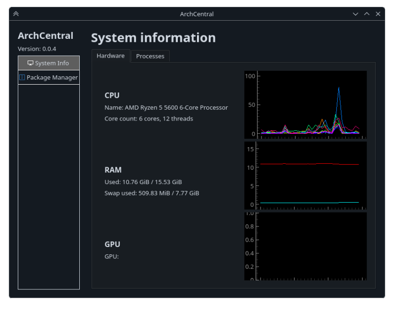

# Szakdolgozat 2025-26 - GUI vezérlőpult készítése az Arch Linux disztribúcióhoz

Ebben a repositoryban érhető el a szakdolgozatom tárgyát képező projekt.

## Mappák:
- archcentral: a python projekt helye
- tools: a fejlesztést segítő szkriptek és egyebek

## A projekt közvetlen futtatásához szükséges:

0. Legyünk a projekt gyökérkönyvtárában.

1. Egy virtual environment (venv) létrehozása és használata:
    ```bash
    python -m venv .venv
    source .venv/bin/activate
    ```

2. Majd ezután egy interaktív telepítés a virtual environment-be pip-el:
    ```bash
    pip install -e .
    ```

3. Ezután az ```archcentral``` parancs használatával indítható a program.


# Thesis/final project 2025-26 - Making a GUI control panel for the Arch Linux distribution

The project that is the subject of my thesis/final project is available in this repository.

## Directories:
- archcentral: the location of the python project
- tools: scripts and other things for helping development

## For running the project directly, you need:

0. Be in the root directory of the project.

1. Creating and using a virtual environment (venv):
    ```bash
    python -m venv .venv
    source .venv/bin/activate
    ```

2. Then installing the project interactively into the venv via pip:
    ```bash
    pip install -e .
    ```

3. After this you can launch the program by typing ```archcentral``` .

# Screenshots / képernyőképek

1. Hardware monitor GUI within the System Information module:

